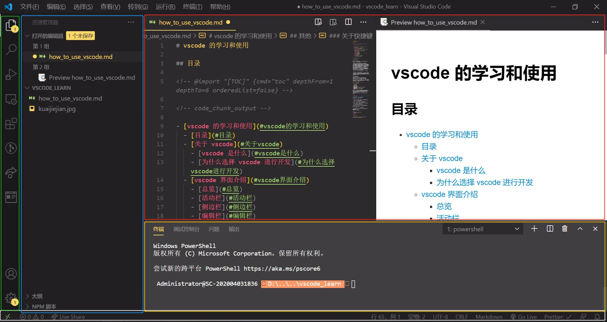
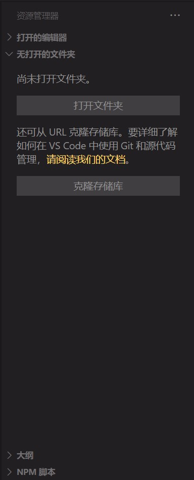
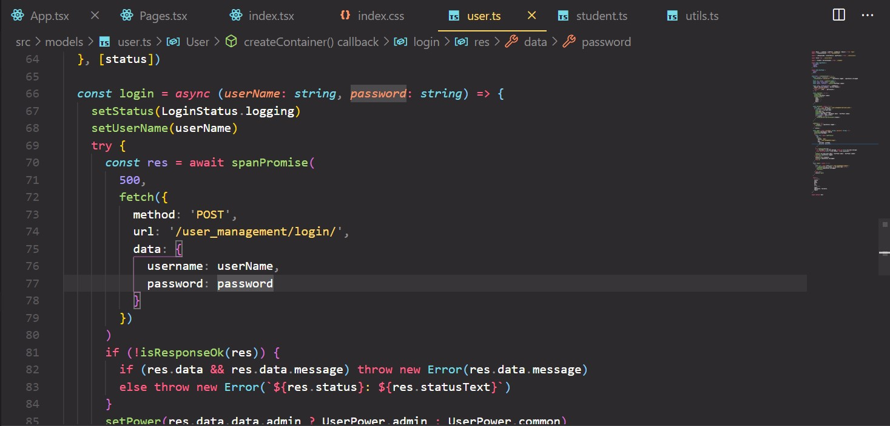
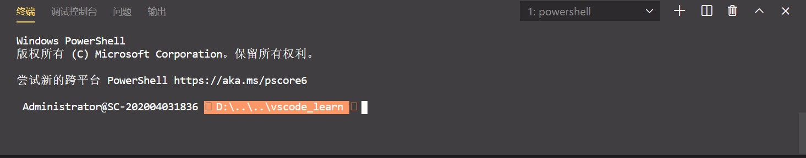
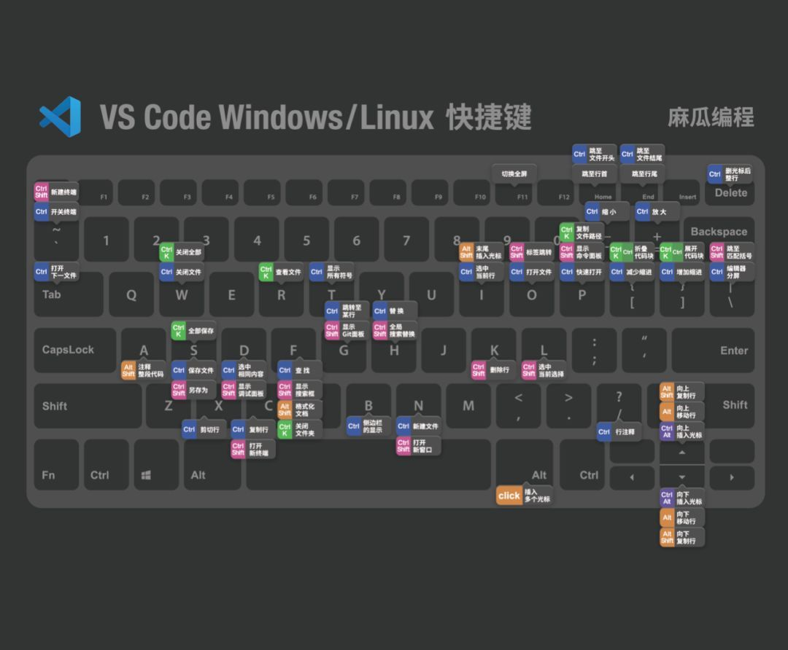
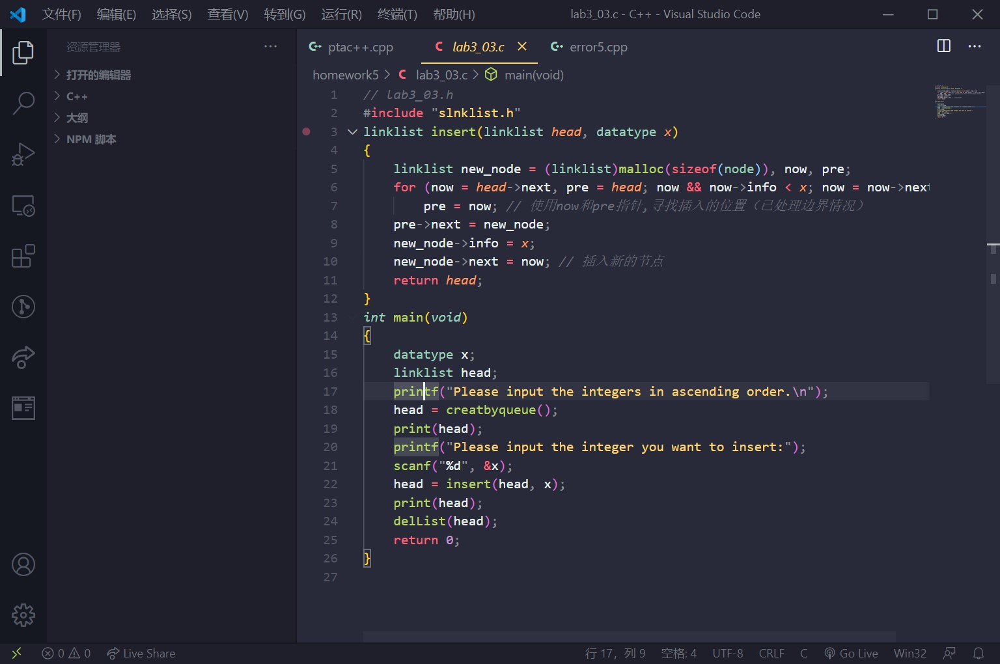
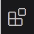
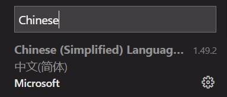
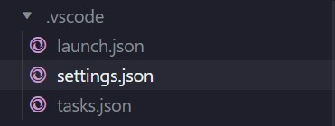

# vscode 的学习和使用

## 目录

<!-- @import "[TOC]" {cmd="toc" depthFrom=1 depthTo=6 orderedList=false} -->

<!-- code_chunk_output -->

- [vscode 的学习和使用](#vscode-的学习和使用)
  - [目录](#目录)
  - [关于 vscode](#关于-vscode)
    - [vscode 是什么](#vscode-是什么)
    - [为什么选择 vscode 进行开发](#为什么选择-vscode-进行开发)
      - [vscode 优点](#vscode-优点)
      - [vscode 不足](#vscode-不足)
  - [vscode 界面介绍](#vscode-界面介绍)
    - [总览](#总览)
    - [活动栏](#活动栏)
    - [侧边栏](#侧边栏)
    - [编辑栏](#编辑栏)
    - [面板栏](#面板栏)
    - [状态栏](#状态栏)
  - [其他](#其他)
    - [关于快捷键](#关于快捷键)
    - [关于插件](#关于插件)
    - [关于如何设置 vscode 为中文](#关于如何设置-vscode-为中文)
  - [配置环境](#配置环境)
    - [C/C++](#C/C++)
      - [环境变量](#环境变量)
      - [配置文件](#配置文件)
    - [Python](#Python)
    - [JavaScript](#JavaScript)

<!-- code_chunk_output -->

---

## 关于 vscode

### vscode 是什么

现在学习 C/C++的时候大多用的是 Code::Blocks 或 Dev C++, 这些都是**IDE**.

> **集成开发环境**（**IDE，Integrated Development Environment**）是用于提供程序开发环境的应用程序，一般包括代码编辑器、编译器、调试器和图形用户界面等工具。集成了代码编写功能、分析功能、编译功能、调试功能等一体化的开发软件服务套。所有具备这一特性的软件或者软件套（组）都可以叫集成开发环境。如微软的 Visual Studio 系列，Borland 的 C++ Builder、Delphi 系列等。该程序可以独立运行，也可以和其它程序并用。IDE 多被用于开发 HTML 应用软件。例如，许多人在设计网站时使用 IDE（如 HomeSite、DreamWeaver 等），因为很多项任务会自动生成。

而 vscode 和 windows 自带的记事本是属于**编辑器**.

> **编辑器**的本质是可以写字符就行,像 windows 自带的写字板就是最简单的编辑器,他的识别级别在文字级,他只显示你想写入,和打开的文本内容.他不管你写什么内容.只提供接收与显示功能。

总结一下

| 类型   | 软件                 | 体积     | 功能         |
| :----- | :------------------- | :------- | :----------- |
| IDE    | vs2019, Code::Blocks | 普遍较大 | 功能较多     |
| 编辑器 | vscode               | 普遍较小 | 只有基础功能 |

但是,既然 vscode 是只有基础功能(~~其实比记事本的功能丰富很多~~)的编辑器,甚至无法运行代码,我们为什么要选择 vscode 进行开发呢?

### 为什么选择 vscode 进行开发

#### vscode 优点

- 开源，免费
- 自定义配置
- 集成[git](git.md)
- 智能提示强大
- 支持各种文件格式（html/css/csv etc.）
- 调试功能强大
- 各种方便的[快捷键](#关于快捷键)
- 强大的[插件](#关于插件)扩展

正是由于 vscode 成熟的插件生态圈,各种各样丰富的插件,让 vscode 的功能丰富且强大,除了不能运行代码 ~~(其实也有补救方法)~~ ,其余各方面都可以赶得上普通的 IDE.因此我们选择用 vscode 进行开发.  
~~(本体的体积小,比动辄几十 G 的 visual studio 好多了)~~

#### vscode 不足

无论再怎么多的功能,vscode 还是不能像 IDE 一样开箱即用.写不同类型的代码的时候都要手动配置环境(虽然配置一次就够了),相对来说操作有点麻烦.但是如果配好环境和顺手的扩展后,vscode 绝对是最好用的编辑器之一.

---

## vscode 界面介绍

### 总览

<center>



^开发时的界面^

</center>

- 绿色区域:[活动栏](#活动栏)
- 蓝色区域:[侧边栏](#侧边栏)
- 红色区域:[编辑栏](#编辑栏)
- 黄色区域:[面板栏](#面板栏)
- 白色区域:[状态栏](#状态栏)

### 活动栏

  
从上到下分别是:

- **资源管理器**: 展示打开的编辑器与文件夹
- **搜索**: 在打开的文件夹范围内(或本文件)搜索
- **运行**: 程序运行时进行监视与调试,例如配合程序断点来监视变量的变化
- **远程资源管理器**: 暂且不用,主要用于远程开发,然而我们现在最主要时在本地开发
- **扩展**(~~插件~~): 主要用于搜索与安装插件

另: 某些插件会在也会在状态栏上展示,例如 gitlens, liveshare 等

### 侧边栏

  
**配合活动栏进行操作,活动栏的各种行动均在侧边栏中进行.**  
如图中分别展示了:

1. 当前已经打开的编辑器,将在编辑栏中显示
1. 已打开的文件夹,可在此直接新建文件和修改后缀等一系列操作
1. 大纲,展示你的代码结构,随时跳转与整理你的代码.
1. NPM 脚本我到现在都没用过.

### 编辑栏


我们将在这里编辑我们的代码,可进行同时打开多个编剧区域等等操作,这里没有什么值得讲的.

### 面板栏


前面提到我们无法在编辑器里运行代码,但是我们可以在面板栏中打开 cmd/powershell,即命令行窗口,也可以实时运行文件,从另一个方面上实现了 IDE 的操作.

- 终端:即命令行窗口等 shell.
- 调试控制台:略.
- 问题:显示代码的问题在哪里,一般配合插件进行使用.
- 输出:略.

### 状态栏


主要展示了当前的格式与文件属性等内容.

- 行,列: 当前光标的位置.
- 空格: 选择代码的缩进格式(tab/空格)(2/4)
- 编码(UTF-8): 选择编码格式,关于编码格式在此.  
  [字符集和字符编码知识梳理](https://www.jianshu.com/p/9be901c5b1c3)
- 行尾序列(CRLF): 选择换行的形式(\r\n 还是\n)
- 语言(Markdown): 当前文件的语言.
- 后面的为插件附带,无需考虑.~~其实是我也没用过~~

---

## 其他

### 关于快捷键

（只列出了很小一部分常用快捷键）

**`Ctrl + /`** （单行注释）

**`Shift + Alt + A`** （多行注释）若要取消单行或多行注释在按一次该快捷键即可

**`Ctrl + Shift + Enter`** （上方插入一行，鼠标光标在当前行的任意位置都可以直接换行到上一行）

**`Ctrl + Enter`** （下方插入一行，鼠标光标在当前行的任意位置都可以直接换行到下一行）

**`Alt + Shift + F`** （格式化代码，不需要全选中代码，直接格式化即可）

**`Ctrl + Shift + F`** （查找文件）

_点击设置选择 keyboard shortcuts，右边会弹出所有快捷键目录_  
下列出部分常用快捷键

<center>


^转自知乎^

</center>

### 关于插件

[vscode 必装的 10 个高效开发插件](https://zhuanlan.zhihu.com/p/56719281)  
~~我也忘了我以前插件在哪里找的了...反正不止这些~~

可以考虑下载 monokai pro 这个插件,下载完主题界面将如下图.  


### 关于如何设置 vscode 为中文

在活动栏中点击扩展  
  
搜索 Chinese  
  
点击第一个插件 install 后即可

---

## 配置环境

前面已经介绍过，VSCode 只是一款文本编辑器，不仅需要安装对应编程语言的扩展，还需要安装相应的编译器或者解释器。首先先创建一个文件夹，用来存放代码。此处建议不同的编程语言采用不同的文件夹，因为 VSCode 打开文件夹（称作工作目录）之后，如果进行一定的配置之后，会在该文件夹下产生一个叫".vscode"的文件夹，该文件夹中存放的是一些.json 的配置文件，这些配置文件是对工作目录中的代码文件产生作用的。所以以后需要相同开发环境的时候，不用每次都去创建配置文件并进行相关配置，直接拷贝.vscode 文件夹即可，但是第一次还是需要手动配置出自己所需的环境。

### C/C++

#### 环境变量

我最常用的编译器是 MinGW-w64,下载解压后的安装包我将会发上群里，包括.vscode 文件的内容在下面.嘛这样好像就没有什么要说的了,不过需要配置**环境变量**,具体的配置方法也十分简单,将 mingw 文件下 bin 文件夹添加到环境变量就好了.

> **环境变量**是在操作系统中一个具有特定名字的对象，它包含了一个或者多个应用程序所将使用到的信息。例如 Windows 和 DOS 操作系统中的 path 环境变量，当要求系统运行一个程序而没有告诉它程序所在的完整路径时，系统除了在当前目录下面寻找此程序外，还应到 path 中指定的路径去找。用户通过设置环境变量，来更好的运行进程。

插件只需要最普通的 _C/C++_ 就可以了.  
至此就可以用 vscode 编写 C/C++代码了,虽然这个和我们的工作开发没有关系,但是起码在 vscode 的界面打作业代码美观很多,起码比在 code::blocks 的界面打代码好吧(个人观点)~~不接受反驳~~.

#### 配置文件

.vscode 中文件内容如下

结构  


内容

```json
// launch.json
// https://github.com/Microsoft/vscode-cpptools/blob/master/launch.md
{
  "version": "0.2.0",
  "configurations": [
    {
      "name": "(gdb) Launch", // 配置名称，将会在启动配置的下拉菜单中显示
      "type": "cppdbg", // 配置类型，cppdbg对应cpptools提供的调试功能；可以认为此处只能是cppdbg
      "request": "launch", // 请求配置类型，可以为launch（启动）或attach（附加）
      "program": "${fileDirname}/${fileBasenameNoExtension}.exe", // 将要进行调试的程序的路径
      "args": [], // 程序调试时传递给程序的命令行参数，一般设为空即可
      "stopAtEntry": false, // 设为true时程序将暂停在程序入口处，相当于在main上打断点
      "cwd": "${workspaceFolder}", // 调试程序时的工作目录，此为工作区文件夹；改成${fileDirname}可变为文件所在目录
      "environment": [], // 环境变量
      "externalConsole": true, // 为true时使用单独的cmd窗口，与其它IDE一致；18年10月后设为false可调用VSC内置终端
      "internalConsoleOptions": "neverOpen", // 如果不设为neverOpen，调试时会跳到“调试控制台”选项卡，你应该不需要对gdb手动输命令吧？
      "MIMode": "gdb", // 指定连接的调试器，可以为gdb或lldb。但我没试过lldb
      "miDebuggerPath": "gdb.exe", // 调试器路径，Windows下后缀不能省略，Linux下则不要
      "setupCommands": [
        {
          // 模板自带，好像可以更好地显示STL容器的内容，具体作用自行Google
          "description": "Enable pretty-printing for gdb",
          "text": "-enable-pretty-printing",
          "ignoreFailures": false
        }
      ],
      "preLaunchTask": "Compile" // 调试会话开始前执行的任务，一般为编译程序。与tasks.json的label相对应
    }
  ]
}
```

```json
// settings.json
{
  "files.defaultLanguage": "c", // ctrl+N新建文件后默认的语言
  "editor.formatOnType": true, // 输入分号(C/C++的语句结束标识)后自动格式化当前这一行的代码
  "editor.suggest.snippetsPreventQuickSuggestions": false, // clangd的snippets有很多的跳转点，不用这个就必须手动触发Intellisense了
  "editor.acceptSuggestionOnEnter": "off", // 我个人的习惯，按回车时一定是真正的换行，只有tab才会接受Intellisense
  // "editor.snippetSuggestions": "top", // （可选）snippets显示在补全列表顶端，默认是inline

  "code-runner.runInTerminal": true, // 设置成false会在“输出”中输出，无法输入
  "code-runner.executorMap": {
    "c": "cd $dir && gcc '$fileName' -o '$fileNameWithoutExt.exe' -Wall -g -O2 -static-libgcc -std=c11 -fexec-charset=GBK && &'$dir$fileNameWithoutExt'",
    "cpp": "cd $dir && g++ '$fileName' -o '$fileNameWithoutExt.exe' -Wall -g -O2 -static-libgcc -std=c++17 -fexec-charset=GBK && &'$dir$fileNameWithoutExt'"
    // "c": "cd $dir && gcc $fileName -o $fileNameWithoutExt.exe -Wall -g -O2 -static-libgcc -std=c11 -fexec-charset=GBK && $dir$fileNameWithoutExt",
    // "cpp": "cd $dir && g++ $fileName -o $fileNameWithoutExt.exe -Wall -g -O2 -static-libgcc -std=c++17 -fexec-charset=GBK && $dir$fileNameWithoutExt"
  }, // 右键run code时运行的命令；未注释的仅适用于PowerShell（Win10默认），文件名中有空格也可以编译运行；注释掉的适用于cmd（win7默认），PS和bash也能用，但文件名中有空格时无法运行
  "code-runner.saveFileBeforeRun": true, // run code前保存
  "code-runner.preserveFocus": true, // 若为false，run code后光标会聚焦到终端上。如果需要频繁输入数据可设为false
  "code-runner.clearPreviousOutput": false, // 每次run code前清空属于code runner的终端消息，默认false
  "code-runner.ignoreSelection": true, // 默认为false，效果是鼠标选中一块代码后可以单独执行，但C是编译型语言，不适合这样用

  "C_Cpp.clang_format_sortIncludes": true,
  "files.associations": {
    "limits": "cpp",
    "iostream": "cpp",
    "string": "cpp"
  } // 格式化时调整include的顺序（按字母排序）
}
```

```json
// tasks.json
// https://code.visualstudio.com/docs/editor/tasks
{
  "version": "2.0.0",
  "tasks": [
    {
      "label": "Compile", // 任务名称，与launch.json的preLaunchTask相对应
      "command": "g++", // 要使用的编译器，C++用g++
      "args": [
        "${file}",
        "-o", // 指定输出文件名，不加该参数则默认输出a.exe，Linux下默认a.out
        "${fileDirname}/${fileBasenameNoExtension}.exe",
        "-g", // 生成和调试有关的信息
        "-Wall", // 开启额外警告
        "-static-libgcc", // 静态链接libgcc，一般都会加上
        "-fexec-charset=GBK" // 生成的程序使用GBK编码，不加这一条会导致Win下输出中文乱码
        // "-std=c11", // C++最新标准为c++17，或根据自己的需要进行修改
      ], // 编译的命令，其实相当于VSC帮你在终端中输了这些东西
      "type": "process", // process是vsc把预定义变量和转义解析后直接全部传给command；shell相当于先打开shell再输入命令，所以args还会经过shell再解析一遍
      "group": {
        "kind": "build",
        "isDefault": true // 不为true时ctrl shift B就要手动选择了
      },
      "presentation": {
        "echo": true,
        "reveal": "always", // 执行任务时是否跳转到终端面板，可以为always，silent，never。具体参见VSC的文档
        "focus": false, // 设为true后可以使执行task时焦点聚集在终端，但对编译C/C++来说，设为true没有意义
        "panel": "shared" // 不同的文件的编译信息共享一个终端面板
      }
      // "problemMatcher":"$gcc" // 此选项可以捕捉编译时终端里的报错信息；但因为有Lint，再开这个可能有双重报错
    }
  ]
}
```

### Python

python 同样需要解释器去运行 python 代码,安装地址如下  
https://www.python.org/downloads/windows/

安装完成后同样的需要配置环境变量,把 python.exe 所在的地址添加到环境变量当中.
~~或者在安装的时候勾选`Add Python 3.8 to PATH`~~

安装完成后通过在命令行中输入 python 确认是否成功安装, 确认后输入exit()退出.

```
C:\> python
exit()
```
插件也是简单的 *Python* 即可.  
在后端培训中我们会讲一下虚拟环境,pip 等事情,现在暂且不表.

### JavaScript

准确来讲不是安装javascript(这东西不用安装),而是安装node.js.
>Node使用Module模块去划分不同的功能，以简化应用的开发。Modules模块有点像C++语言中的类库。每一个Node的类库都包含了十分丰富的各类函数，比如http模块就包含了和http功能相关的很多函数，可以帮助开发者很容易地对比如http,tcp/udp等进行操作，还可以很容易的创建http和tcp/udp的服务器。

安装地址:https://nodejs.org/en/
还是要配置环境变量,跟上面两个相似.但是与上面两个不同的是,我们没有什么十分特定的插件适合这个.